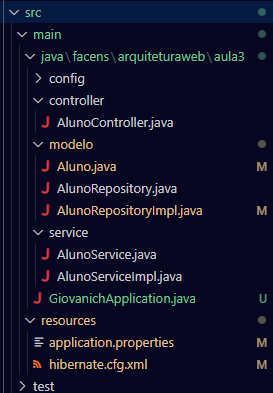
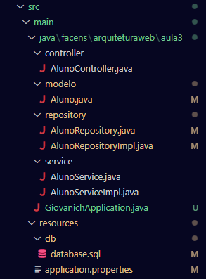

# ArquiteturaWeb_ac1

## Descrição
Exercício 6, api funcionando via PostMan

## Organização de pastas

## Método GET
### Requisição geral:

### Requisição por Id:

## Método POST:

## Método Remove:

## Publicação: https://github.com/GiovaniCh7/AC1_ArqWeb.git
## Data de Publicação: 02/04/2024
