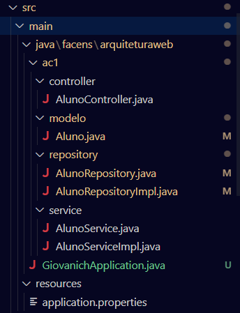
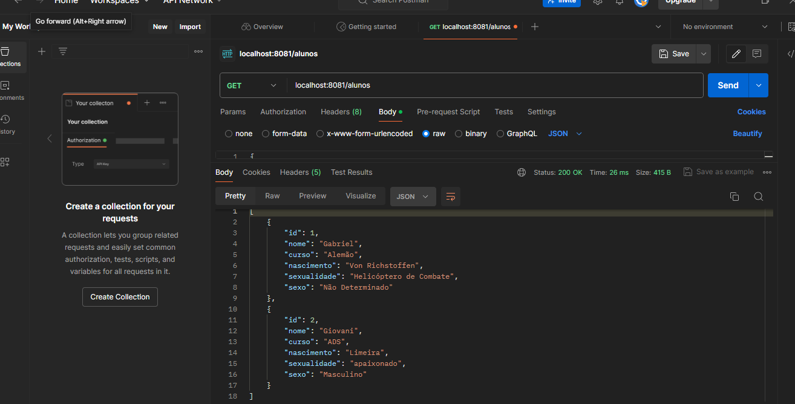
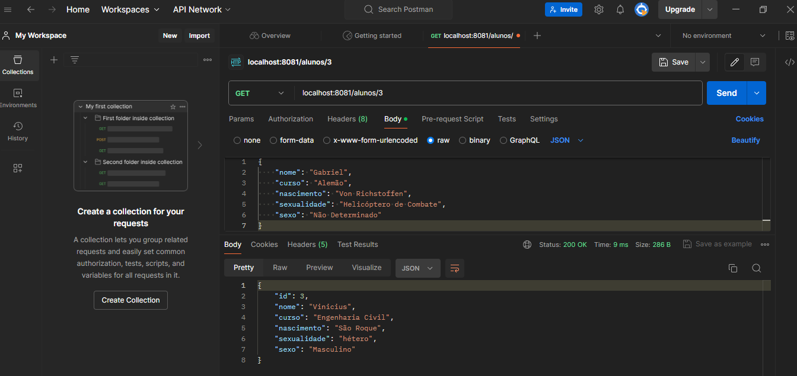

# ArquiteturaWeb_ac1

## Descrição
Aula 3 e 4 juntas, funcionalidade da API com o programa PostMan

## Organização de pastas

## Método GET

### Requisição geral:

### Requisição por Id:

## Método POST:

## Publicação: https://github.com/GiovaniCh7/AC1_ArqWeb
## Data de Publicação: 02/04/2024
