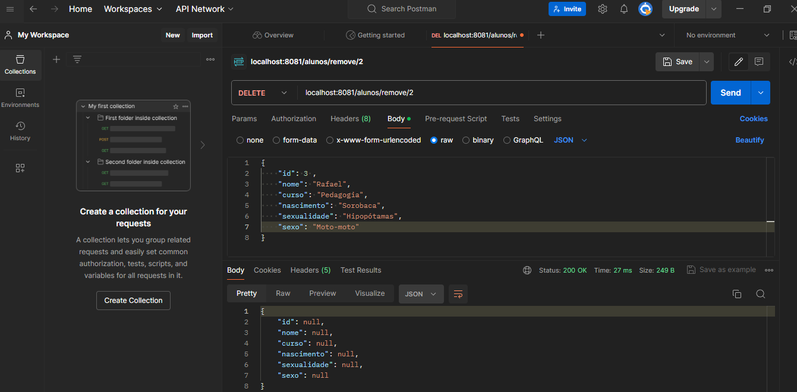
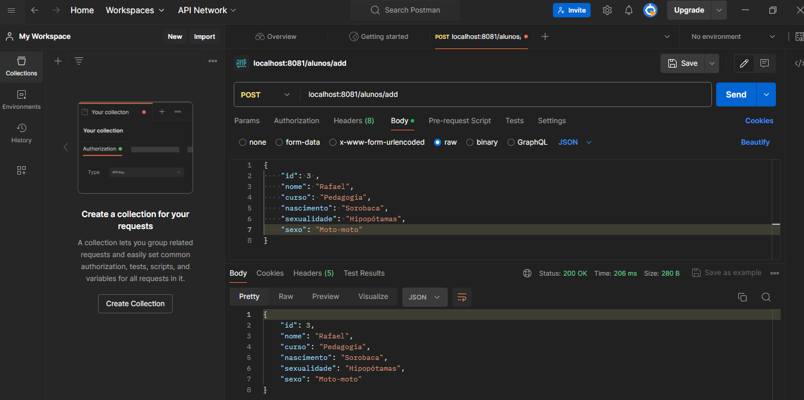
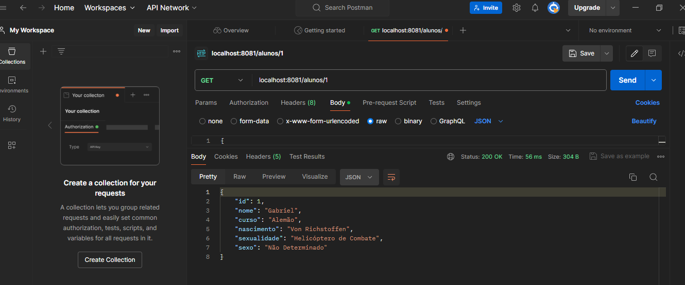

# ArquiteturaWeb_ac1

## Descrição
Exercício Aula 5 com funcionamento da API com PostMan.

## Organização de pastas

## Método GET

### Requisição geral:

### Requisição por Id:

## Método POST:

## Publicação: https://github.com/GiovaniCh7/AC1_ArqWeb
## Data de Publicação: 02/04/2024
